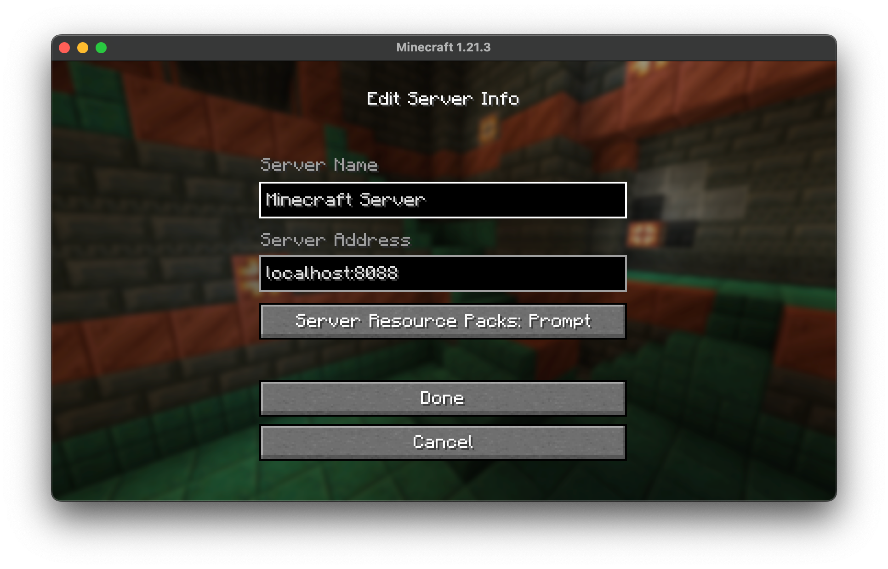
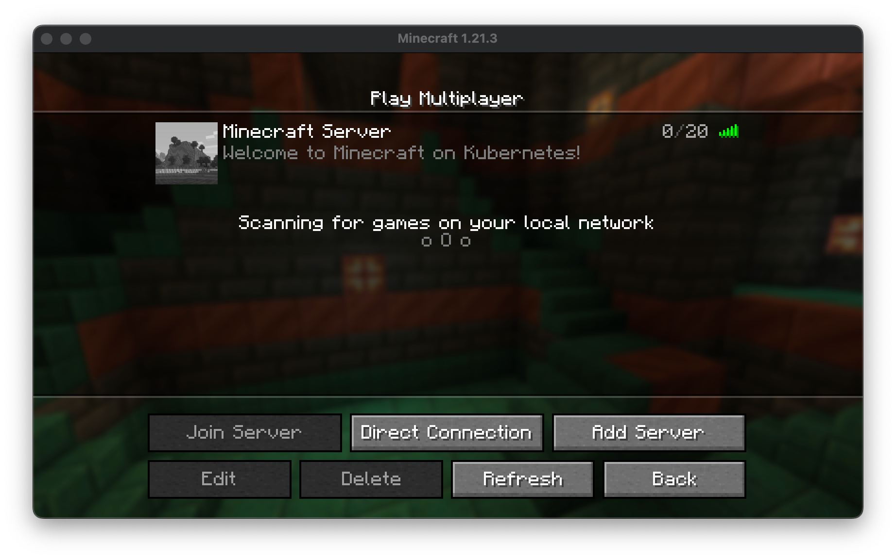

# Argo CD: Enable Helm Support in Kustomize

Nothing is more controversial in the Kubernetes community than whether to use Helm or Kustomize. I always advocate the philosophy of "using the right tool for the right job." It avoids the problem of "everything looks like a nail when you have a hammer." Yet, sometimes you need to combine similar tools to get the best results. Helm and Kustomize are two tools. When combined smartly, they can boost productivity and flexibility. But, before we jump into the details, let's first understand what Helm and Kustomize are and what they do.

## Helm and Helm Charts

Helm is the de facto default package manager for Kubernetes applications. It provides an efficient way to package, share, and deploy your Kubernetes applications. It can be used via the CLI or through first-class support in CD tools like Argo CD or Flux. One of the key features I like about Helm is its powerful templating engine. It lets you create reusable templates for your Kubernetes resources. This keeps your YAML files DRY (Don't Repeat Yourself). It makes it easier to manage and maintain your Kubernetes resources.

Example of the template in Helm I took from
the [kube-prometheus-stack](https://github.com/prometheus-community/helm-charts/blob/main/charts/kube-prometheus-stack/templates/prometheus/servicemonitor.yaml)

```yaml
{{- if and .Values.prometheus.enabled .Values.prometheus.serviceMonitor.selfMonitor}}
apiVersion: monitoring.coreos.com/v1
kind: ServiceMonitor
metadata:
  name: {{template "kube-prometheus-stack.fullname" .}}-prometheus
  namespace: {{template "kube-prometheus-stack.namespace" .}}
  labels:
    app: {{template "kube-prometheus-stack.name" .}}-prometheus
  {{include "kube-prometheus-stack.labels" . | indent 4}}
  {{- with .Values.prometheus.serviceMonitor.additionalLabels}}
  {{- toYaml . | nindent 4}}
  {{- end}}
spec: {{- include "servicemonitor.scrapeLimits" .Values.prometheus.serviceMonitor | nindent 2}}
  selector:
    matchLabels:
      app: {{template "kube-prometheus-stack.name" .}}-prometheus
      release: {{$.Release.Name | quote}}
      self-monitor: "true"
  namespaceSelector:
    matchNames:
    - {{printf "%s" (include "kube-prometheus-stack.namespace" .) | quote}}
  endpoints:
  - port: {{.Values.prometheus.prometheusSpec.portName}}
    {{- if .Values.prometheus.serviceMonitor.interval}}
    interval: {{.Values.prometheus.serviceMonitor.interval}}
    {{- end}}
    {{- if .Values.prometheus.serviceMonitor.scheme}}
    scheme: {{.Values.prometheus.serviceMonitor.scheme}}
    {{- end}}
    {{- if .Values.prometheus.serviceMonitor.tlsConfig}}
    tlsConfig: {{- toYaml .Values.prometheus.serviceMonitor.tlsConfig | nindent 6}}
    {{- end}}
    {{- if .Values.prometheus.serviceMonitor.bearerTokenFile}}
    bearerTokenFile: {{.Values.prometheus.serviceMonitor.bearerTokenFile}}
    {{- end}}
    path: "{{ trimSuffix "/" .Values.prometheus.prometheusSpec.routePrefix }}/metrics"
    {{- if .Values.prometheus.serviceMonitor.metricRelabelings}}
    metricRelabelings: {{- tpl (toYaml .Values.prometheus.serviceMonitor.metricRelabelings | nindent 6) .}}
    {{- end}}
    {{- if .Values.prometheus.serviceMonitor.relabelings}}
    relabelings: {{- toYaml .Values.prometheus.serviceMonitor.relabelings | nindent 6}}
    {{- end}}
  - port: reloader-web
    {{- if .Values.prometheus.serviceMonitor.interval}}
    interval: {{.Values.prometheus.serviceMonitor.interval}}
    {{- end}}
    {{- if .Values.prometheus.serviceMonitor.scheme}}
    scheme: {{.Values.prometheus.serviceMonitor.scheme}}
    {{- end}}
    {{- if .Values.prometheus.serviceMonitor.tlsConfig}}
    tlsConfig: {{- toYaml .Values.prometheus.serviceMonitor.tlsConfig | nindent 6}}
    {{- end}}
    path: "/metrics"
    {{- if .Values.prometheus.serviceMonitor.metricRelabelings}}
    metricRelabelings: {{- tpl (toYaml .Values.prometheus.serviceMonitor.metricRelabelings | nindent 6) .}}
    {{- end}}
    {{- if .Values.prometheus.serviceMonitor.relabelings}}
    relabelings: {{- toYaml .Values.prometheus.serviceMonitor.relabelings | nindent 6}}
    {{- end}}
  {{- range .Values.prometheus.serviceMonitor.additionalEndpoints}}
  - port: {{.port}}
    {{- if or $.Values.prometheus.serviceMonitor.interval .interval}}
    interval: {{default $.Values.prometheus.serviceMonitor.interval .interval}}
    {{- end}}
    {{- if or $.Values.prometheus.serviceMonitor.proxyUrl .proxyUrl}}
    proxyUrl: {{default $.Values.prometheus.serviceMonitor.proxyUrl .proxyUrl}}
    {{- end}}
    {{- if or $.Values.prometheus.serviceMonitor.scheme .scheme}}
    scheme: {{default $.Values.prometheus.serviceMonitor.scheme .scheme}}
    {{- end}}
    {{- if or $.Values.prometheus.serviceMonitor.bearerTokenFile .bearerTokenFile}}
    bearerTokenFile: {{default $.Values.prometheus.serviceMonitor.bearerTokenFile .bearerTokenFile}}
    {{- end}}
    {{- if or $.Values.prometheus.serviceMonitor.tlsConfig .tlsConfig}}
    tlsConfig: {{- default $.Values.prometheus.serviceMonitor.tlsConfig .tlsConfig | toYaml | nindent 6}}
    {{- end}}
    path: {{.path}}
    {{- if or $.Values.prometheus.serviceMonitor.metricRelabelings .metricRelabelings}}
    metricRelabelings: {{- tpl (default $.Values.prometheus.serviceMonitor.metricRelabelings .metricRelabelings | toYaml | nindent 6) .}}
    {{- end}}
    {{- if or $.Values.prometheus.serviceMonitor.relabelings .relabelings}}
    relabelings: {{- default $.Values.prometheus.serviceMonitor.relabelings .relabelings | toYaml | nindent 6}}
    {{- end}}
  {{- end}}
  {{- end}}
```

As powerful as Helm is, it has its limitations. One of them is the customisation of third-party Helm charts. And this is where Kustomize comes in. But more on that later.

## Kustomize

Kustomize lets you, as the name suggests, customise your raw, template-free YAML files. It does not alter the original YAML files but instead applies patches to them. Like Helm, Kustomize has a stand-alone CLI tool. It also has first-class integrations in kubectl and CD tools like Argo CD and Flux. There are different ways to use Kustomize. The most common variation is to use Kustomize with a base and overlay structure. The base has the raw, template-free YAML files. The overlay has the patches to apply to the base.

Example file structure:

```bash
~/someApp
├── base
│   ├── deployment.yaml
│   ├── kustomization.yaml
│   └── service.yaml
└── overlays
    ├── development
    │   ├── cpu_count.yaml
    │   ├── kustomization.yaml
    │   └── replica_count.yaml
    └── production
        ├── cpu_count.yaml
        ├── kustomization.yaml
        └── replica_count.yaml
```

Keep in mind, that you need to have the `kustomization.yaml` file in each directory to tell Kustomize which resources to
apply and which patches to use.

Example of a `kustomization.yaml` file:

```yaml
apiVersion: kustomize.config.k8s.io/v1beta1
kind: Kustomization

labels:
- pairs:
    app: someApp

resources:
- deployment.yaml
- service.yaml
```

This example will apply the `deployment.yaml` and `service.yaml` files in the base directory and add the label
`app: someApp` to each resource.

## Combining Helm and Kustomize

Now that we know the basics of Helm and Kustomize, let's combine them to get the best of both worlds. Before we use Argo CD to deploy our application, let's create a demo use case.

### Use Case

Think about a scenario where you would like to use the new `Gateway API` from Kubernetes. Unfortunately, most of the Helm charts do not support the `Gateway API` yet. Now this is where Kustomize comes in. As an example of this use case, I am going to deploy a `Minecraft` server.

### Create the Kustomize Project

First, let's create a new Kustomize project. We will use the `kustomize create` command to create a new project.

```bash
kustomize init
```

Now open the `kustomization.yaml` file and add the following content:

```yaml
apiVersion: kustomize.config.k8s.io/v1beta1
kind: Kustomization

resources:
- base/gateway.yaml

helmCharts:
- name: minecraft
  releaseName: my
  repo: https://itzg.github.io/minecraft-server-charts/
  version: 4.23.2
  valuesInline:
    minecraftServer:
      eula: "true"
```

Create the `base` directory and add the `gateway.yaml` file with the following content:

```yaml
kind: GatewayClass
apiVersion: gateway.networking.k8s.io/v1
metadata:
  name: eg
spec:
  controllerName: gateway.envoyproxy.io/gatewayclass-controller
---
apiVersion: gateway.networking.k8s.io/v1
kind: Gateway
metadata:
  name: minecraft-gateway
spec:
  gatewayClassName: eg
  listeners:
  - name: minecraft
    protocol: TCP
    port: 8088
    allowedRoutes:
      kinds:
      - kind: TCPRoute
---
apiVersion: gateway.networking.k8s.io/v1alpha2
kind: TCPRoute
metadata:
  name: minecraft-route
spec:
  parentRefs:
  - name: minecraft-gateway
    sectionName: minecraft
  rules:
  - backendRefs:
    - name: my-minecraft
      port: 25565
```

Now let's apply the Kustomize project:

```bash
kustomize build --enable-helm | kubectl apply -f -
```

Important to note is the `--enable-helm` flag. This flag tells Kustomize to enable Helm support.

So far, so good. We have deployed a Minecraft server using Helm. We added the missing `Gateway API` support using Kustomize.

The question now is, how can we deploy this application using Argo CD?

## Deploy the Application using Argo CD

First we need to deploy Argo CD using Helm and following content in the `values.yaml` file:

```yaml
configs:
  cm:
    kustomize.buildOptions: "--enable-helm"
  # the rest of the values are only for demonstration purposes
  secret:
    argocdServerAdminPassword: "$2a$10$RjjTokiJSaTQt8jAMOUTK.O0VIZ3.0AEs3/JxtaFKGZir93yFPEOG"
    argocdServerAdminPasswordMtime: "2023-11-13T09:23:16Z"
  params:
    "server.insecure": true
```

The most important part is the `kustomize.buildOptions: "--enable-helm"` configuration. This tells Argo CD to enable
Helm support in Kustomize.

Now we can deploy Argo CD and the Envoy Gateway using Helm:

```bash
helm repo add argo https://argoproj.github.io/argo-helm
helm repo update
helm upgrade -i my-argo-cd argo/argo-cd -f values.yaml --namespace argocd --create-namespace
helm install eg oci://docker.io/envoyproxy/gateway-helm --version v1.2.1 -n envoy-gateway-system --create-namespace
```

After the deployment is finished we can create a new Argo CD application using the following content:

```bash
kubectl apply -f minecraft-application.yaml
```

With the following content in the `minecraft-application.yaml` file:

```yaml
apiVersion: argoproj.io/v1alpha1
kind: Application
metadata:
  name: minecraft-application
  namespace: argocd
spec:
  destination:
    namespace: minecraft
    server: https://kubernetes.default.svc
  project: default
  source:
    repoURL: https://github.com/dirien/quick-bites.git
    targetRevision: main
    path: argocd-kustomize-helms-support
  syncPolicy:
    automated:
      prune: true
      selfHeal: true
    syncOptions:
    - ServerSideApply=true
    - CreateNamespace=true
```

With this setup, we have successfully deployed a Minecraft server using Helm and added the missing `Gateway API`
support. You can check the `TCPRoute` and `Gateway` resources by running the following command:

```bash
kubectl get gateway,tcproute -n minecraft

NAME                                                  CLASS   ADDRESS   PROGRAMMED   AGE
gateway.gateway.networking.k8s.io/minecraft-gateway   eg                False        5m19s

NAME                                                 AGE
tcproute.gateway.networking.k8s.io/minecraft-route   5m19s
```

Start yor Minecraft client and connect to the server using the IP address of the `minecraft-gateway` resource and the
port. In this case it would be `8088`.





> Note: Enabling Helm support in every app has a slight performance cost. If you want more control over which Applications to use, create an Argo CD `ConfigurationManagementPlugin`.

## Conclusion

Combining Helm and Kustomize can be a powerful way to deploy your app. Use it when you need to customize third-party Helm charts. Or, if you prefer Kustomize and don't want to write Helm charts for your own deployments.
