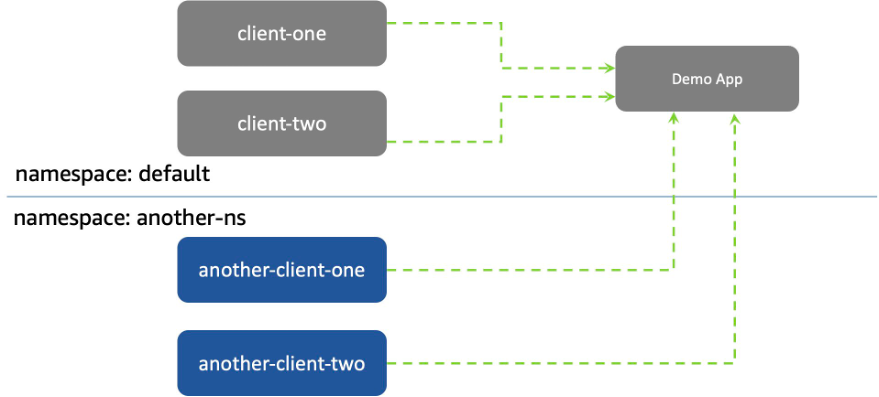

# How to enable network policies in EKS using the AWS VPC CNI plugin with Pulumi

## Introduction

Recently, AWS announced the native support for enforcing Kubernetes network policies using the AWS VPC CNI plugin. We
have now the option in AWS VPC CNI to implement pod networking and network policies to ensure secure traffic in our
Kubernetes clusters.

According to this GitHub Roadmap [issue](https://github.com/aws/containers-roadmap/issues/1478), the support for
network policies in AWS VPC CNI is one of the most requested features.

But why is this feature so important? By default, in Kubernetes, all pods can communicate with each other without any
restrictions. If you want to restrict the communication between pods, you need to use an external network policy engine
like Calico. Matter of fact, There is even a documentation in the AWS EKS documentation on how to use install the Calico
network policy engine in EKS. https://docs.aws.amazon.com/eks/latest/userguide/calico.html

Having this option native in AWS VPC CNI is a great addition and removes the need to install an external network
policy, reducing the complexity of the cluster and the maintenance overhead for the platform team.

In this blog post, we will see how to enable network policies in EKS using the AWS VPC CNI plugin with Pulumi.

## What are network policies - in a nutshell

Kubernetes network policies helps you to define and enforce how pods communicate with each other. Think about virtual
firewalls, which allows you to segment and secure your cluster by specifying incoming (ingress) and outgoing (egress)
traffic rules. These rules are based on various parameters like pod labels, namespaces, IP addresses, IP blocks (CIDR)
or ports.

Having the ability to define network policies in Kubernetes is a great to achieve a stronger security posture without
running into the risk of misconfigurations or scalability issues.

## Getting started

To enable network policies in EKS, you need to ensure that you are using the AWS VPC CNI version `1.14.0` or later. Your
EKS cluster should be running on Kubernetes version `1.25` or later.

To let AWS VPC CNI manage all network stuff, your cluster requires the following configuration:

- AWS IAM with a separate IAM role with the `AmazonEKS_CNI_Policy` managed policy associated to it using IRSA( IAM
  Roles for Service Accounts)
- Since IRSA requires an OpenID Connect (OIDC) endpoint, you need to enable OIDC for your cluster.

The Pulumi demo code will be written in TypeScript, but you can use any other supported language.

To follow along, you need to have additionally the following tools installed:

* [Pulumi CLI](https://www.pulumi.com/docs/get-started/install/) installed.
* [kubectl](https://kubernetes.io/docs/tasks/tools/install-kubectl/) installed.
* optional [K9s](https://k9scli.io/topics/install/), if you want to quickly interact with your cluster.
* [AWS CLI](https://docs.aws.amazon.com/cli/latest/userguide/getting-started-install.html) installed.

And of course, you need to have an AWS account!

## Creating the Pulumi stack

Let's start by creating a new Pulumi stack. We will use the `aws-ts` template to create a new Pulumi stack.

```shell
pulumi new aws-typescript --force
```

You can keep the default values for the project name, description and stack name. The only parameter you need to change
is the region. In my case, I will use `eu-central-1` as my region.

Now we add following Pulumi packages to our project:

```shell
npm install @pulumi/aws@5.42.0  @pulumi/eks@1.0.3 --save
```

Now we can start writing our Pulumi code. First, we set up the networking part of our cluster. We will create a new VPC
with two private subnets in two different availability zones. Additionally, we will create an internet gateway and a
route table to allow internet access for our cluster.

```typescript
import * as pulumi from "@pulumi/pulumi";
import * as aws from "@pulumi/aws";
import * as eks from "@pulumi/eks";

let publicSubnetCIDRs: string[] = [
    "10.0.0.0/27",
    "10.0.0.32/27"
];

let availabilityZones: string[] = [
    "eu-central-1a",
    "eu-central-1b"
];

const clusterName = "my-pulumi-demo-cluster";

// Create a VPC for our cluster.
const vpc = new aws.ec2.Vpc("my-pulumi-demo-vpc", {
    cidrBlock: "10.0.0.0/24",
});

const igw = new aws.ec2.InternetGateway("my-pulumi-demo-igw", {
    vpcId: vpc.id,
});

const rt = new aws.ec2.RouteTable("my-pulumi-demo-rt", {
    vpcId: vpc.id,
    routes: [
        {
            cidrBlock: "0.0.0.0/0",
            gatewayId: igw.id,
        }
    ]
});

let privateSubnets: pulumi.Output<string>[] = [];

for (let i = 0; i < publicSubnetCIDRs.length; i++) {
    const subnet = new aws.ec2.Subnet(`my-pulumi-demo-public-subnet-${i}`, {
        vpcId: vpc.id,
        cidrBlock: publicSubnetCIDRs[i],
        mapPublicIpOnLaunch: false,
        assignIpv6AddressOnCreation: false,
        availabilityZone: availabilityZones[i],
        tags: {
            Name: `my-pulumi-demo-public-subnet-${i}`,
        }
    });
    new aws.ec2.RouteTableAssociation(`my-pulumi-demo-rt-assoc-${i}`, {
        subnetId: subnet.id,
        routeTableId: rt.id,
    });
    privateSubnets.push(subnet.id);
}

const cluster = new eks.Cluster("my-pulumi-demo-cluster", {
    name: clusterName,
    vpcId: vpc.id,
    privateSubnetIds: privateSubnets,
    endpointPublicAccess: true,
    instanceType: "t3.medium",
    desiredCapacity: 2,
    minSize: 1,
    maxSize: 3,
    providerCredentialOpts: {
        profileName: "default",
    },
    createOidcProvider: true,
});
```

Next part is to create the IAM role for the AWS VPC CNI plugin. I found this part always the most challenging part when
working with AWS! But thanks to Pulumi, I can express everything quite easily in code.

```typescript
const assumeRolePolicy = pulumi.all([cluster.core.oidcProvider.arn, cluster.core.oidcProvider.url])
    .apply(([arn, url]) =>
        aws.iam.getPolicyDocumentOutput({
            statements: [{
                effect: "Allow",
                actions: ["sts:AssumeRoleWithWebIdentity"],
                principals: [
                    {
                        type: "Federated",
                        identifiers: [
                            arn
                        ],
                    },
                ],
                conditions: [
                    {
                        test: "StringEquals",
                        variable: `${url.replace('https://', '')}:sub`,
                        values: ["system:serviceaccount:kube-system:aws-node"],
                    },
                    {
                        test: "StringEquals",
                        variable: `${url.replace('https://', '')}:aud`,
                        values: ["sts.amazonaws.com"],
                    }
                ],
            }],
        })
    );

const vpcRole = new aws.iam.Role("my-pulumi-demo-eks-vpc-cni-role", {
    assumeRolePolicy: assumeRolePolicy.json,
});

const vpcRolePolicy = new aws.iam.RolePolicyAttachment("my-pulumi-demo-eks-vpc-cni-role-policy", {
    role: vpcRole,
    policyArn: "arn:aws:iam::aws:policy/AmazonEKS_CNI_Policy",
});
```

Important here that we set in the trust relationship the `sts:AssumeRoleWithWebIdentity` action and
the `system:serviceaccount:kube-system:aws-node` service account as a condition. This is required to allow the AWS VPC
CNI plugin to assume the role and manage the network.

Last part is to install the AWS VPC CNI plugin in our cluster. We will use the `aws.eks.Addon` resource to install the
plugin without the need to shell out to a Helm chart or something else.

```typescript
const vpcCniAddon = new aws.eks.Addon("my-pulumi-demo-vpc-cni-addon", {
    clusterName: cluster.eksCluster.name,
    addonName: "vpc-cni",
    addonVersion: "v1.15.0-eksbuild.2",
    resolveConflicts: "OVERWRITE",
    configurationValues: pulumi.jsonStringify({
        "enableNetworkPolicy": "true",
    }),
    serviceAccountRoleArn: vpcRole.arn,
});
```

Important options here are the `enableNetworkPolicy` option, which enables the network policy support in AWS VPC CNI and
the `serviceAccountRoleArn` option, which allows us to specify the previously created IAM role for the AWS VPC CNI. This
will add the required `eks.amazonaws.com/role-arn` annotation to the `kube-system/aws-node` service account.

Now we can deploy our stack using the `pulumi up` command. Pulumi will show us the changes and ask us to confirm the
changes.

```shell
Previewing update (dev)

View in Browser (Ctrl+O): https://app.pulumi.com/dirien/pulumi-eks-vpc-cni-network-policies/dev/previews/0c82a949-537e-4734-817e-d623a61d602f

     Type                                   Name                                                      Plan       
 +   pulumi:pulumi:Stack                    pulumi-eks-vpc-cni-network-policies-dev                   create     
 +   ├─ eks:index:Cluster                   my-pulumi-demo-cluster                                    create     
 +   │  ├─ eks:index:ServiceRole            my-pulumi-demo-cluster-instanceRole                       create     
 +   │  │  ├─ aws:iam:Role                  my-pulumi-demo-cluster-instanceRole-role                  create     
 +   │  │  ├─ aws:iam:RolePolicyAttachment  my-pulumi-demo-cluster-instanceRole-e1b295bd              create     
 +   │  │  ├─ aws:iam:RolePolicyAttachment  my-pulumi-demo-cluster-instanceRole-3eb088f2              create     
 +   │  │  └─ aws:iam:RolePolicyAttachment  my-pulumi-demo-cluster-instanceRole-03516f97              create     
 +   │  ├─ eks:index:ServiceRole            my-pulumi-demo-cluster-eksRole                            create     
 +   │  │  ├─ aws:iam:Role                  my-pulumi-demo-cluster-eksRole-role                       create     
 +   │  │  └─ aws:iam:RolePolicyAttachment  my-pulumi-demo-cluster-eksRole-4b490823                   create     
 +   │  ├─ eks:index:RandomSuffix           my-pulumi-demo-cluster-cfnStackName                       create     
 +   │  ├─ aws:ec2:SecurityGroup            my-pulumi-demo-cluster-eksClusterSecurityGroup            create     
 +   │  ├─ aws:ec2:SecurityGroupRule        my-pulumi-demo-cluster-eksClusterInternetEgressRule       create     
 +   │  ├─ aws:iam:InstanceProfile          my-pulumi-demo-cluster-instanceProfile                    create     
 +   │  ├─ aws:eks:Cluster                  my-pulumi-demo-cluster-eksCluster                         create     
 +   │  ├─ aws:iam:OpenIdConnectProvider    my-pulumi-demo-cluster-oidcProvider                       create     
 +   │  ├─ eks:index:VpcCni                 my-pulumi-demo-cluster-vpc-cni                            create     
 +   │  ├─ aws:ec2:SecurityGroup            my-pulumi-demo-cluster-nodeSecurityGroup                  create     
 +   │  ├─ pulumi:providers:kubernetes      my-pulumi-demo-cluster-eks-k8s                            create     
 +   │  ├─ aws:ec2:SecurityGroupRule        my-pulumi-demo-cluster-eksNodeIngressRule                 create     
 +   │  ├─ aws:ec2:SecurityGroupRule        my-pulumi-demo-cluster-eksExtApiServerClusterIngressRule  create     
 +   │  ├─ aws:ec2:SecurityGroupRule        my-pulumi-demo-cluster-eksNodeInternetEgressRule          create     
 +   │  ├─ aws:ec2:SecurityGroupRule        my-pulumi-demo-cluster-eksNodeClusterIngressRule          create     
 +   │  ├─ kubernetes:core/v1:ConfigMap     my-pulumi-demo-cluster-nodeAccess                         create     
 +   │  ├─ aws:ec2:SecurityGroupRule        my-pulumi-demo-cluster-eksClusterIngressRule              create     
 +   │  ├─ aws:ec2:LaunchConfiguration      my-pulumi-demo-cluster-nodeLaunchConfiguration            create     
 +   │  ├─ aws:cloudformation:Stack         my-pulumi-demo-cluster-nodes                              create     
 +   │  └─ pulumi:providers:kubernetes      my-pulumi-demo-cluster-provider                           create     
 +   ├─ aws:ec2:Vpc                         my-pulumi-demo-vpc                                        create     
 +   ├─ aws:ec2:InternetGateway             my-pulumi-demo-igw                                        create     
 +   ├─ aws:ec2:Subnet                      my-pulumi-demo-public-subnet-1                            create     
 +   ├─ aws:ec2:Subnet                      my-pulumi-demo-public-subnet-0                            create     
 +   ├─ aws:ec2:RouteTable                  my-pulumi-demo-rt                                         create     
 +   ├─ aws:ec2:RouteTableAssociation       my-pulumi-demo-rt-assoc-1                                 create     
 +   ├─ aws:ec2:RouteTableAssociation       my-pulumi-demo-rt-assoc-0                                 create     
 +   ├─ aws:iam:Role                        my-pulumi-demo-eks-vpc-cni-role                           create     
 +   ├─ aws:eks:Addon                       my-pulumi-demo-vpc-cni-addon                              create     
 +   └─ aws:iam:RolePolicyAttachment        my-pulumi-demo-eks-vpc-cni-role-policy                    create     


Outputs:
    kubeconfig     : output<string>
    vpcCniAddonName: "vpc-cni"

Resources:
    + 38 to create

Do you want to perform this update?  [Use arrows to move, type to filter]
  yes
> no
  details
```

After confirming the changes, Pulumi will start to create the resources. This will take a few minutes, at the end it's
AWS! After the stack is created, we can get the kubeconfig file using the `pulumi stack output` command.

```shell
pulumi stack output kubeconfig --show-secrets > kubeconfig
# check the service account annotation
kubectl get sa -n kube-system aws-node -o json --kubeconfig kubeconfig | jq '.metadata.annotations."eks.amazonaws.com/role-arn"'
```

As you can see, the `eks.amazonaws.com/role-arn` annotation is set to the IAM role we created earlier.

```shell
"eks.amazonaws.com/role-arn": "arn:aws:iam::123456789012:role/my-pulumi-demo-eks-vpc-cni-role-20973ad"
```

## Testing the network policies

Let's reuse the demo application from the folks of AWS. Here a picture of the application architecture.



We're now going to roll out a sample NGINX application named "demo-app" along with a basic client application in the
default namespace. Furthermore, we'll set up an additional client application in a separate namespace named "
another-ns".

To deploy the demo application, we will use the `kubectl apply` command.

```shell
git clone https://github.com/aws-samples/eks-network-policy-examples.git
cd eks-network-policy-examples
kubectl apply -f advanced/manifests/ --kubeconfig kubeconfig
```

### Ensure connectivity and permit all ingress and egress

To validate the connection, open another terminal and check connectivity with the client pod deployed earlier.

```bash
kubectl exec -it client-one -- curl demo-app
```

A successful API call will result in a response.

### Block all communication

To implement isolation, apply a policy that denies all traffic to the demo-app across all namespaces.

```bash
kubectl apply -f advanced/policies/01-deny-all-ingress.yaml
```

All pods specified in the network policy will now deny any ingress traffic to demo-app.

```bash
kubectl exec -it client-one -- curl demo-app
```

This command will result in a connection timeout.

### Authorize ingress from the same namespace

Now, we’ll permit ingress traffic from client-one to demo-app but only if they're in the same namespace.

```bash
kubectl apply -f advanced/policies/03-allow-ingress-from-samens-client-one.yaml
```

The NGINX welcome page's HTML should be the response.

```bash
kubectl exec -it client-one -- curl --max-time 3 demo-app
```

### Authorize ingress from another-ns namespace

We will now grant traffic permissions from a different namespace.

```bash
kubectl apply -f advanced/policies/04-allow-ingress-from-xns.yaml
```

Attempting access to demo-app from a client in a different namespace should display a welcome message.

```bash
kubectl exec -it -n another-ns another-client-one -- curl --max-time 3 demo-app.default
```

### Restrict egress communication

To isolate all egress from the client-one pod in the default namespace, apply the following:

```bash
kubectl apply -f advanced/policies/06-deny-egress-from-client-one.yaml
```

All egress actions, inclusive of DNS lookups from client one, will now be denied.

```bash
kubectl exec -it client-one -- nslookup demo-app
```

### Permit egress communication

Let’s grant egress permissions across various ports and namespaces, which will include DNS traffic.

```bash
kubectl apply -f advanced/policies/08-allow-egress-to-demo-app.yaml
```

Egress traffic, both to DNS and to the demo-app, should now be permitted.

```bash
kubectl exec -it client-one -- curl --max-time 3 demo-app
```

## Housekeeping

To clean up the resources, run the `pulumi destroy` command.

```shell
pulumi destroy
```

## Conclusion

It is great to see that native support for network policies in AWS VPC CNI is finally here, and we don't need to install
an external network policy engine anymore. Reducing the complexity of the cluster and the maintenance overhead while not
sacrificing security is a great addition and will help to improve the security of you Kubernetes clusters.
